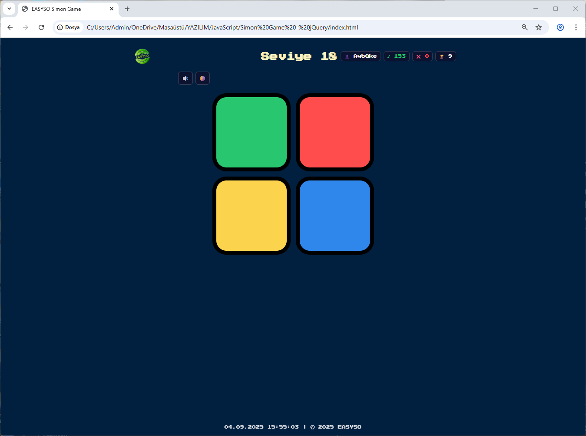
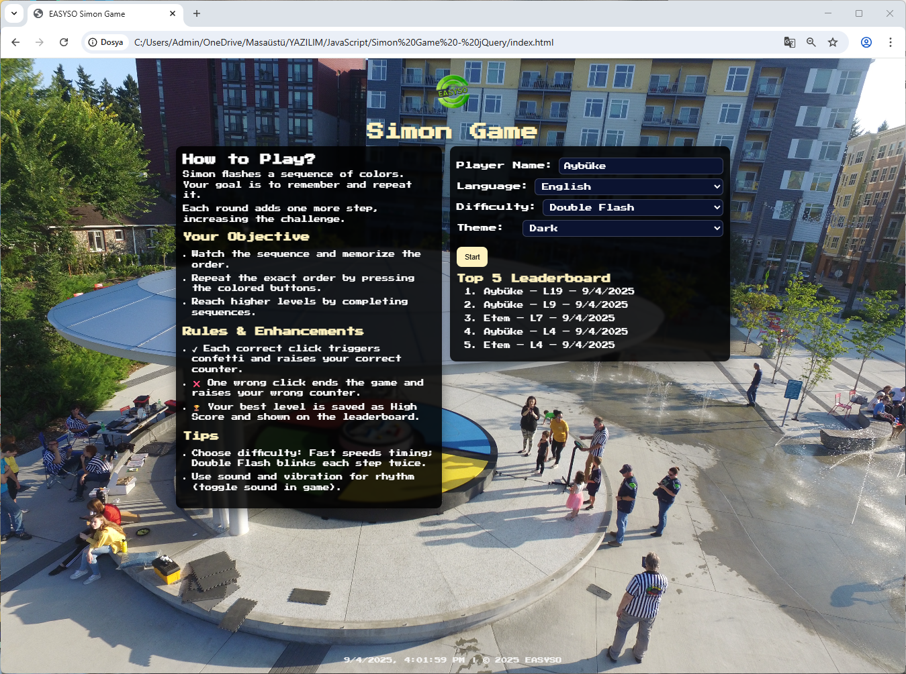
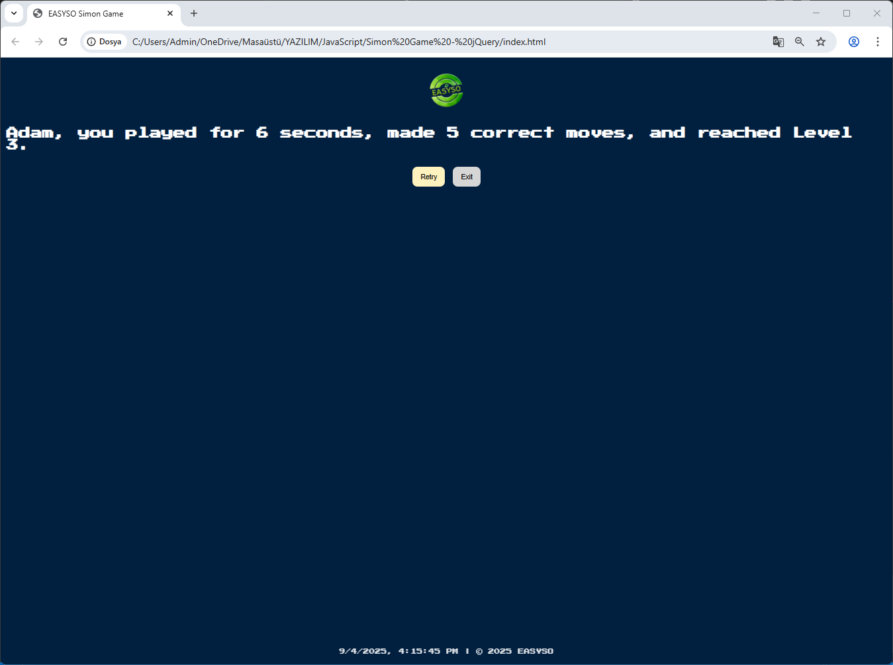
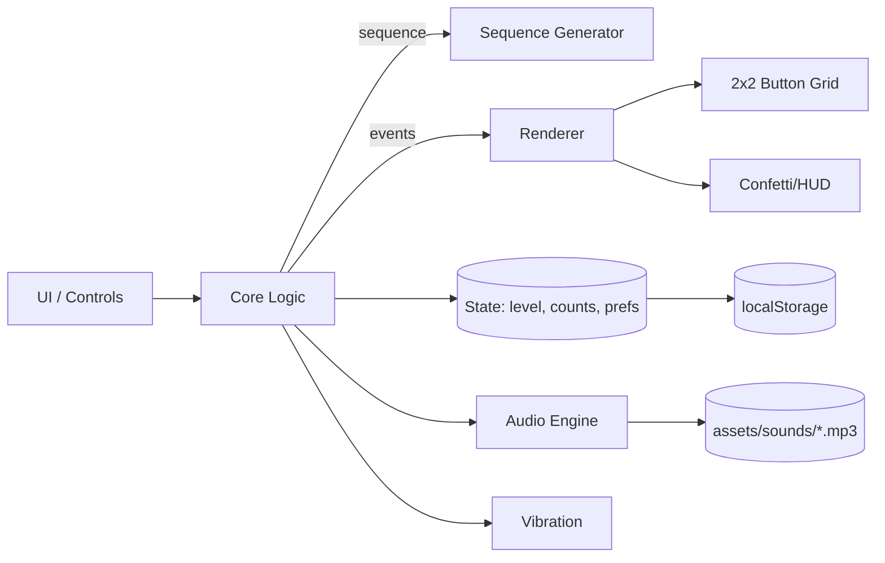

<p align="center">
  
</p>

<h1 align="center">The Simon Game Easyso Version</h1>

<p align="center">
  A classic Simon memory game rebuilt with a modern, internationalized UI — dark/light themes, 6 languages, local leaderboard, and mobile-friendly controls.
  <br>
  <a href="https://etemesaysarac.github.io/The-Simon-Game-Easyso-Version">Live Demo</a> ·
  <a href="https://github.com/etemesaysarac/The-Simon-Game-Easyso-Version">Latest Release</a> ·
  <a href="#-abstract">Docs</a> ·
  <a href="#-citation">Cite</a>
</p>

<p align="center">
  <a href="LICENSE"></a>
  
  
  
</p>

<p align="center">
  <b></b> · <a href="https://github.com/etemesaysarac/The-Simon-Game-Easyso-Version/blob/main/README.md#%EF%B8%8F-architecture">[EN]</a> · 
</p>

## 🔬 Abstract

**Easyso Simon Game** is a browser-based memory game implemented in HTML/CSS/JavaScript (jQuery). It reproduces the classic Simon gameplay while adding a professional layer of UX and internationalization:

* **6 languages** (EN, TR, AR, ES, DE, FR) with right-to-left support for Arabic.
* **Themes** (Dark/Light), **difficulty modes** (Normal, Fast, Double Flash).
* **Local persistence** (player name, preferences, high score, top-5 leaderboard) via `localStorage`.
* **Mobile-friendly** interactions with haptics (vibration) and accessible visual feedback (confetti, HUD counters).

This README documents the system design, core algorithms, evaluation setup, and usage instructions to enable reliable replication and extension.

## 🧭 Table of Contents

* [Abstract](#-abstract)
* [Screenshots](#-screenshots)
* [Features](#-features)
* [Architecture](#-architecture)
* [Methodology](#-methodology)
* [Evaluation & Results](#-evaluation--results)
* [Installation](#-installation)
* [Quickstart / Usage](#-quickstart--usage)
* [Configuration](#-configuration)
* [Game Guide](#-game-guide)
* [Performance / Security / A11y](#-performance--security--a11y)
* [Assets & Structure](#-assets--structure)
* [Versioning](#-versioning--roadmap)
* [Contributing](#-contributing)
* [Citation](#-citation)
* [License & Acknowledgments](#-license--acknowledgments)
* [Appendix](#-appendix)
* [Türkçe Özet (TR)](#-turkce-ozet-tr)

## 🖼️ Screenshots

| Home                               | Gameplay                                   | End/Score                                    |
| ---------------------------------- | ------------------------------------------ | -------------------------------------------- |
|  |  |  |

> Screens represent dark mode with English UI; other languages/themes are supported at runtime.

## ⭐ Features

* **Core Gameplay:** Simon-style color sequence generation and user repetition with correctness checking.
* **Internationalization (i18n):** EN, TR, AR (RTL), ES, DE, FR; instant language switching.
* **Themes & UX:** Dark/Light themes, retro font, visual feedback (`flash`, `press`, confetti), audio cues, vibration.
* **Difficulty Modes:** *Normal* (baseline), *Fast* (shorter delays), *Double Flash* (repeat each step twice).
* **Persistence:** Player name, language, theme, difficulty, high score, leaderboard stored in `localStorage`.
* **HUD & Leaderboard:** Live counters (✔ / ❌), level indicator, high score chip, Top-5 sorted by level → date.
* **Responsive Layout:** Works on desktop and mobile; grid scales across viewports.

**Feature Matrix**

| Capability          | Desktop | Mobile | Notes                               |
| ------------------- | ------: | -----: | ----------------------------------- |
| Dark/Light Theme    |       ✅ |      ✅ | `:root[data-theme]` switches tokens |
| Languages (6)       |       ✅ |      ✅ | Arabic uses RTL layout              |
| Difficulty Modes    |       ✅ |      ✅ | Normal / Fast / Double Flash        |
| Sound & Vibration   |       ✅ |      ✅ | Mute toggle; haptics if supported   |
| Leaderboard (Top 5) |       ✅ |      ✅ | `localStorage` persistence          |

## 🏗️ Architecture



## 📐 Methodology

**Algorithmic Overview**

1. Generate the next color (uniform random over {red, blue, green, yellow}).
2. Present the full sequence with timings based on selected difficulty.
3. Capture user input and check against the current index; on mismatch → end.
4. On complete match → increment level and append one new color.

**Key Code Excerpts**

*Difficulty timing model (`game.js`):*

```javascript
const timings = () => {
  switch (difficulty) {
    case "fast":   return { stepDelay: 340, flash: 120, between: 120, double: false };
    case "double": return { stepDelay: 520, flash: 150, between: 150, double: true };
    default:        return { stepDelay: 640, flash: 160, between: 160, double: false };
  }
};
```

*i18n languages and RTL (`game.js`):*

```javascript
const RTL = new Set(["ar"]);
const i18n = { en: { /* … */ }, tr: { /* … */ }, ar: { /* … */ }, es: { /* … */ }, de: { /* … */ }, fr: { /* … */ } };
```

*CSS design tokens (`styles.css`):*

```css
:root {
  --bg: #011F3F; --text: #FEF2BF; --white: #ffffff;
  --panel-bg: rgba(0,0,0,0.86); --ok: #19d36b; --fail: #ff4d4f;
  --card-bg: #0b1330; --button-border: #000;
}
:root[data-theme="light"] {
  --bg: #f7f7fb; --text: #111827; --white: #111827;
  --panel-bg: rgba(255,255,255,0.94); --ok: #0e9f6e; --fail: #e11d48;
  --card-bg: #e6e6ef; --button-border: #333;
}
```

**Complexity**

* **Per round playback:** O(L) time to flash L steps; O(1) extra space beyond the stored sequence.
* **Sequence growth:** Each round appends one color; game ends on first mismatch.

## 📊 Evaluation & Results

**Testbed (example):** Windows 11 (i7‑9700F, Chrome), Mobile Android 13 (Chrome). Audio latency is subject to device/OS.

| Metric                      |    Desktop |     Mobile | Notes              |
| --------------------------- | ---------: | ---------: | ------------------ |
| First paint                 |     \~< 1s |     \~< 1s | Static assets only |
| Input latency (press→sound) | \~10–30 ms | \~20–50 ms | Varies by device   |
| Confetti duration           |  0.6–1.3 s |  0.6–1.3 s | Randomized         |

> Values are indicative; measure locally with DevTools Performance if you need precise numbers.

## 🧩 Installation

No build tools required — it’s a static web app.

```bash
# 1) Clone
git clone https://github.com/USER/REPO
cd REPO

# 2) Open
# Option A: Open index.html in your browser
# Option B: Serve locally (recommended for audio)
# Using VS Code Live Server or Python HTTP server:
python -m http.server 5500
# then visit http://localhost:5500/
```

**Minimal HTML skeleton (ensure jQuery is loaded):**

```html
<!doctype html>
<html lang="en">
<head>
  <meta charset="utf-8" />
  <meta name="viewport" content="width=device-width, initial-scale=1" />
  <link href="https://fonts.googleapis.com/css2?family=Press+Start+2P&display=swap" rel="stylesheet">
  <link rel="stylesheet" href="./styles.css" />
  <title>Easyso Simon Game</title>
</head>
<body>
  <!-- screens + grid here -->
  <script src="https://code.jquery.com/jquery-3.7.1.min.js"></script>
  <script src="./game.js"></script>
</body>
</html>
```

## 🚀 Quickstart / Usage

1. **Enter player name** (min 2 chars).
2. Choose **Language**, **Theme**, **Difficulty**.
3. Press **Start** → watch the sequence → **repeat** it by pressing buttons in order.
4. On mistake, game ends; view stats and **Retry** or **Exit**.

## ⚙️ Configuration

**Runtime options**

* **Language:** `en`, `tr`, `ar`, `es`, `de`, `fr` (Arabic uses RTL layout)
* **Theme:** `dark`, `light`
* **Difficulty:** `normal`, `fast`, `double`
* **Mute:** toggle in-game (🔊/🔇)

**localStorage keys**

| Key                | Purpose        | Example                           |
| ------------------ | -------------- | --------------------------------- |
| `simonLang`        | UI language    | `"tr"`                            |
| `simonDifficulty`  | Difficulty     | `"fast"`                          |
| `simonMuted`       | 1=muted, 0=not | `"1"`                             |
| `simonTheme`       | Theme token    | `"dark"`                          |
| `simonPlayerName`  | Player name    | `"Etem"`                          |
| `simonHighScore`   | Best level     | `"12"`                            |
| `simonLeaderboard` | Top-5 entries  | `[ {name, level, timestamp}, … ]` |

## 🎮 Game Guide

**Controls**

| Action          | Keyboard/Mouse      | Touch          |
| --------------- | ------------------- | -------------- |
| Repeat sequence | Click color buttons | Tap color pads |
| Mute toggle     | Click speaker icon  | Tap icon       |
| Theme toggle    | Use selector        | Use selector   |
| Retry / Exit    | Buttons             | Buttons        |

**How to Play**

* Watch the color flashes and memorize the order.
* Repeat the exact order; each round adds one more step.
* *Double Flash* mode blinks each step twice for extra challenge.

## 🛡️ Performance / Security / A11y

* **Performance:** Lightweight animations; no heavy frameworks.
* **Security:** No network calls; all data stored locally on the device.
* **Accessibility:** High‑contrast themes, large tap targets, visible focus states, optional RTL.

## 📦 Assets & Structure

```text
.
├─ assets/
│  ├─ sounds/
│  │  ├─ blue.mp3
│  │  ├─ green.mp3
│  │  ├─ red.mp3
│  │  ├─ wrong.mp3
│  │  └─ yellow.mp3
│  ├─ image.jpeg
│  ├─ logo.png
│  ├─ Game1.png
│  ├─ Game2.png
│  ├─ Game3.png
│  └─ Game4.png
├─ index.html
├─ styles.css
├─ game.js
└─ README.md
```

> Use **relative paths** (e.g., `./assets/Game1.png`) to keep compatibility with GitHub Pages.

## 🧭 Versioning & Roadmap

* **SemVer:** v1.0.0
* See `CHANGELOG.md`

## 🤝 Contributing

PRs are welcome! Please discuss major changes via an issue first and follow the style of existing code. Consider adding locale strings if you add new UI labels.

## 📚 Citation

If you reference this project, please cite:

```bibtex
@software{easyso_simon_2025,
  title   = {Easyso Simon Game},
  author  = {Etem Saraç},
  year    = {2025},
  url     = {https://github.com/etemesaysarac},
  version = {v2.1.1}
}
```

## 📝 License & Acknowledgments

**License:** MIT (replace link if different) — see [LICENSE](./LICENSE).

Thanks to open assets and libraries used:

* jQuery 3.x for DOM utilities
* Google Fonts — Press Start 2P
* Audio files under `assets/sounds/*.mp3`

## 📎 Appendix

<details>
  <summary>Extended Code Snippets</summary>

*Sequence step playback (excerpt):*

```javascript
function nextSequence() {
  userPattern = [];
  level++;
  $("#level-title").text(`${i18n[currentLang].level} ${level}`);

  const next = colors[Math.floor(Math.random() * colors.length)];
  gamePattern.push(next);

  const t = timings();
  let idx = 0;
  function showStep() {
    const c = gamePattern[idx];
    if (t.double) { flash(c, t.flash); setTimeout(() => flash(c, t.flash), t.flash + 80); }
    else { flash(c, t.flash); }
    playSound(c, true);
    setTimeout(() => {
      idx++;
      if (idx < gamePattern.length) setTimeout(showStep, t.stepDelay);
    }, t.between);
  }
  setTimeout(showStep, 200);
}
```

*Answer checking (excerpt):*

```javascript
function checkAnswer(i) {
  const ok = gamePattern[i] === userPattern[i];
  if (ok) {
    correctCount++; $("#correct-count").text(`✔ ${correctCount}`); confetti();
    if (userPattern.length === gamePattern.length) setTimeout(nextSequence, 560);
  } else {
    wrongCount++; $("#wrong-count").text(`❌ ${wrongCount}`);
    playSound("wrong"); vibrate(220);
    $("body").addClass("game-over"); setTimeout(() => $("body").removeClass("game-over"), 300);
    endGame();
  }
}
```

*Sound helper (excerpt):*

```javascript
function playSound(name) {
  if (muted) return;
  const audio = new Audio(`assets/sounds/${name}.mp3`);
  audio.play().catch(() => {});
}
```

</details>

---

## 🇹🇷 Türkçe Özet (TR)

**Easyso Simon Game**, klasik Simon oyununu modern bir arayüzle sunar. 6 dil (Arapça RTL dâhil), karanlık/açık tema, Normal/Hızlı/Çift Flaş zorlukları, yerel liderlik tablosu ve mobil uyumluluk içerir. Tüm tercihler ve skorlar cihazda `localStorage` ile saklanır. Kurulum için depoyu klonlamak ve `index.html` dosyasını tarayıcıda açmak yeterlidir (ses için yerel sunucu önerilir). Görsel ve bağlantılarda göreli yollar kullanılmalıdır (`./assets/...`).

